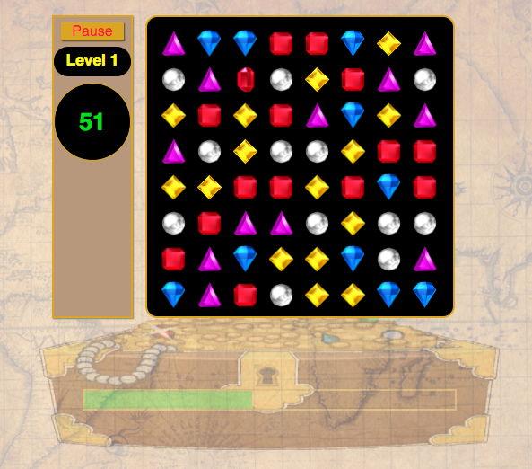

## Bejeweled
[live link][link]

[link]:http://menachemabraham.com/Bejeweled

### Background

Bejeweled is a single player tile-matching puzzle game. The goal is to accumulate points by matching 3 or more jewels in the same column or row. Every time there is a match, all jewels in the match are removed from the grid to be replace by the jewels above them. matches are made by swapping 2 adjacent jewels.



### Functionality

- animated rendering of the game board.
- animated swapping of two adjacent jewels (If it would result in a match).
- animated replacement of matched jewels with those above them.
- accumulation of points dependent on size of matches.
- recursively handling new matches caused by replacement.
- starting a new level upon point accumulation.
- additional jewel types in more advanced levels.

### Architecture and Technologies

This project was implemented using only 'vanilla' JavaScript, html, css.

The overall structure is heavily Object Oriented:
- The Jewel class stores properties for type, position, and reference to it's DOM element.
- The Board class contains the nested structure of columns of jewels.
- The game class keeps track of the general game logic.
- The timer, progress bar, and position object are all extracted into their own classes.
- There is also a NullJewel class for polymorphic replacement of hairy conditionals.
- The animation affects are kept separate from the core game logic to allow for clean procedural code.

```javascript
  move(newPos, delay) {
    this.pos = newPos;
    this.div.data = newPos;
    Jewel.movedJewels.push(this);
    this.animateMove(newPos, delay);
  }

  animateMove(newPos, delay) {
    setTimeout(() => {
      this.div.style.left = `${newPos.px().x}px`;
      this.div.style.top = `${newPos.px().y}px`;
    }, delay);
  }
```

### Future directions

- add gem types for later levels
- hint button
- reset board in absence of possible matches
- bonus special affect jewels
- normal and timed game modes
